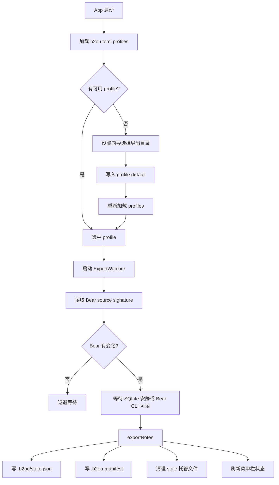
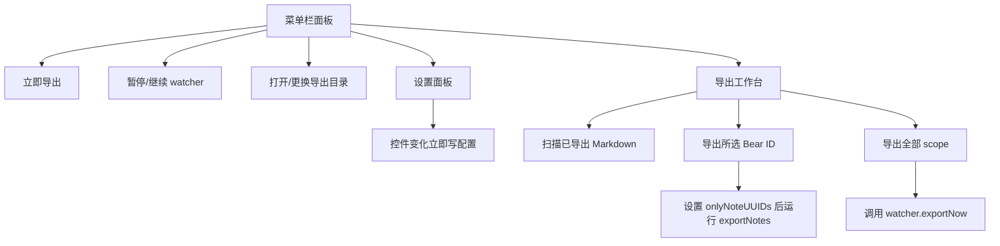

# B2OU 同步流程审计

本文记录 2026-05-01 对菜单栏 App、设置面板、导出工作台和核心导出引擎的第一轮流程梳理。当前产品本质是 Bear 到文件系统的单向安全导出；任何 Obsidian 到 Bear 的回写都应保持为可审查流程，不能静默双向同步。

注：以下内容保留第一轮审计时发现的问题。到 2026-05-02 为止，设置面板已经收敛为显式保存，导出工作台也不再直接写持久规则，而是统一跳转到偏好设置。

## 当前同步主流程

## 当前前台入口

## 主要不合理之处

1. 设置写入没有 profile 语义。第一轮审计时 `writeConfigFile` 会把写盘逻辑困在菜单栏层；到 2026-05-02 已改为共享 profile writer，并补了“保留其他 profile / 未知键”的自动化测试。
2. 设置面板是 immediate-apply。第一轮审计时如此；到 2026-05-02 已收敛为显式保存，写盘失败时不会提前关闭窗口。
3. 工作台扫描的是导出目录，不是 Bear 源。当前代码已经改为 `scan(config:)` 优先读 Bear source，仅在允许时回退到已导出 Markdown，并已有 source-first workflow test 覆盖。
4. 局部导出会调用完整导出入口。当前代码已经改为 sidecar merge，只更新所选 Bear ID 相关 bindings，并有自动化测试覆盖。
5. 增量跳过只看目标文件 mtime。当前代码已经增加 fingerprint guard；外部修改会进入 conflict，而不是静默跳过。
6. stale cleanup 只在 `changedCount > 0` 时运行。当前代码已改为每次全量导出都执行 cleanup，delete-only 场景也纳入测试。
7. 菜单栏状态过于乐观。第一轮审计时这层逻辑散在 `AppDelegate`；到 2026-05-02 已抽成可测试的 menu snapshot，并补了 setup / source problem / sync error / backup error 分流测试，备份成功也不会再覆盖导出失败状态。
8. 工作台和设置面板都能修改导出规则，职责重叠。当前代码已经收口：工作台只负责审查和导出，持久规则统一进入设置面板。
9. 登录启动开关只刷新 UI，不反馈失败。当前代码已改为显式 toggle outcome；`launchctl` 失败会弹出错误，菜单状态保持系统真实值，并有 workflow test 覆盖。
10. source-first 之后，部分深层动作还假设“导出文件一定存在”。当前代码已把 Dashboard / Note Browser 的导出文件动作改成按真实文件存在性启用；同时，`missing source link` 筛选和重建入口改成只在相关数据真实存在时出现。
11. 语言切换只刷新局部窗口。当前代码已把语言切换改成共享 refresh signal；已打开的 Workspace / Dashboard / Note Browser / Settings 会同步刷新文案，而不需要重建整个窗口状态。

## 安全边界

- Bear 是当前收敛源。
- 导出文件是派生物，但可能被 Obsidian 或用户手动编辑，因此必须检测 dirty/conflict。
- `.b2ou/state.json` 是 Bear ID、Bear hash、导出文件 fingerprint 的私有 sidecar，不应写入 Markdown 正文或 front matter。
- `--on-delete remove` 是高风险策略，UI 应默认推荐 trash。
- 回写 Bear 必须使用 Bear CLI 的 optimistic concurrency guard，且需要用户确认。

## 本轮优先修复

1. 局部导出只合并更新相关 bindings，不重建整个 sidecar。
2. 增量跳过前检查当前文件 fingerprint 是否等于上次导出 fingerprint；不相等则阻止静默跳过并标记冲突。
3. 删除清理从 `changedCount > 0` 改为每次全量导出执行，避免只删除不清理。
4. 补测试覆盖局部 state merge、dirty file guard、delete-only cleanup、profile scoped writes，以及菜单状态快照里的导出/备份错误分流。
